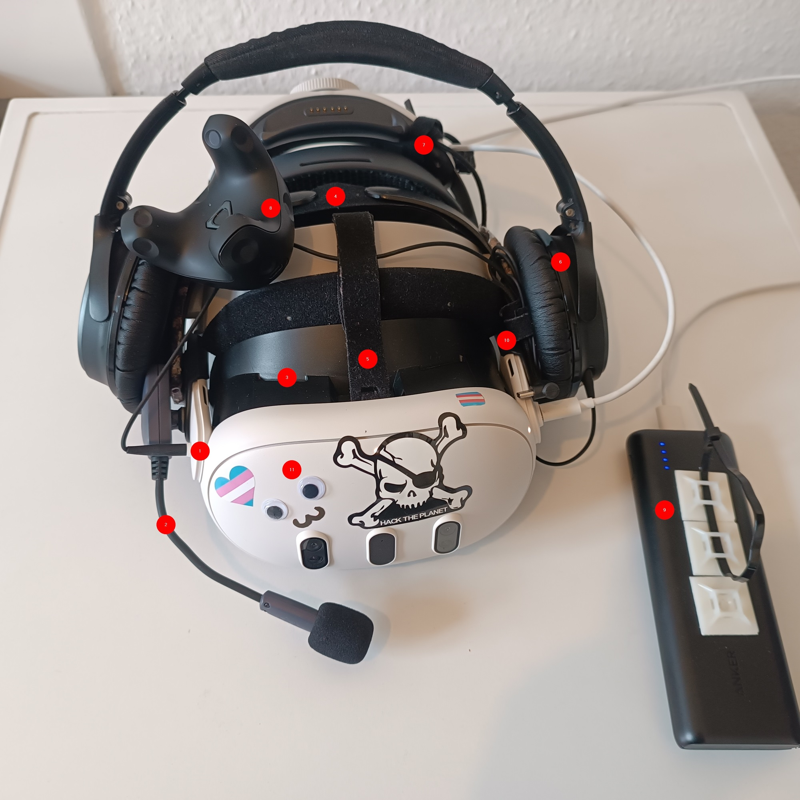
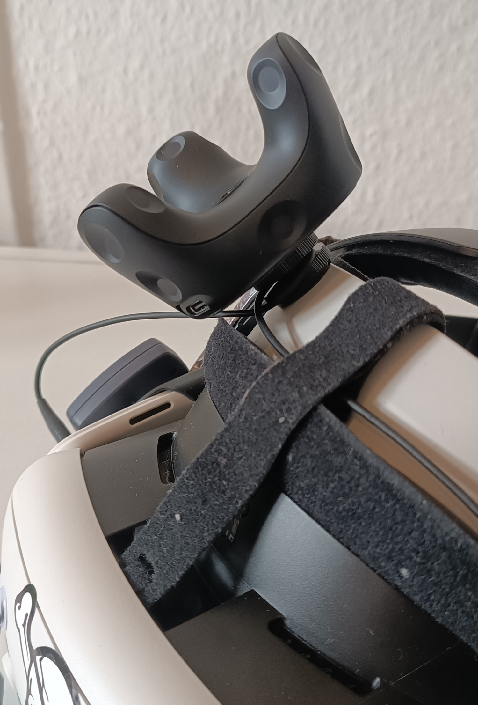
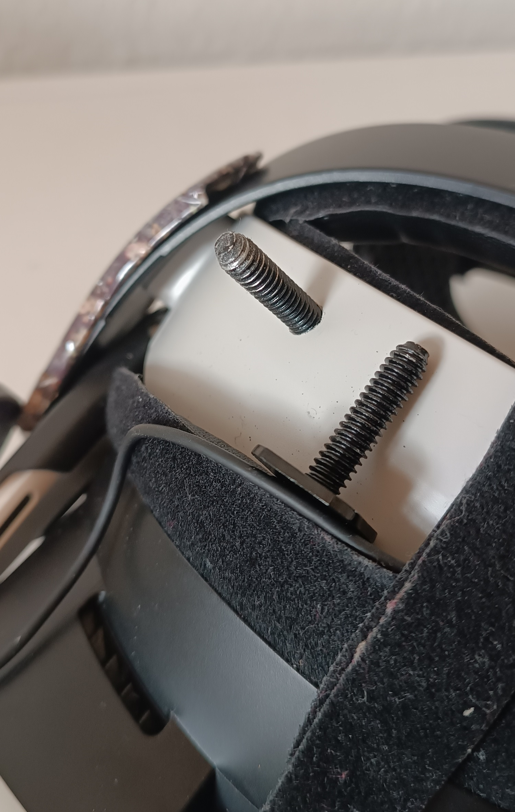
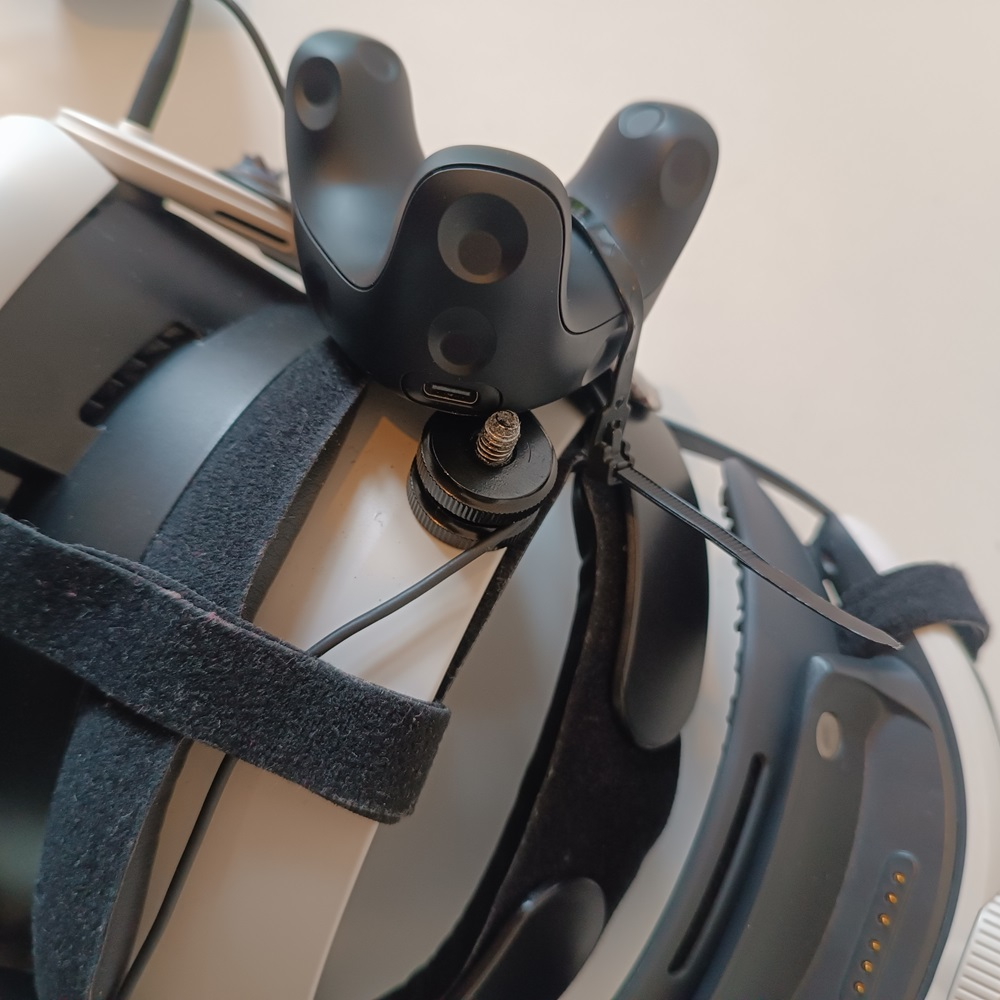

# VR Setup : wireless Quest 3 + Full Body Tracking

!> For reference: Initially set up around July 2024.

Notes on my VR setup.

## Hardware

### My current headset setup

1. Cable for Headphone *permanently* attached to be able to detach the headphones without having to re-organize the cable every time. Use a cable without a mic to easily use the Quests Mic or an external one without having to mess with the settings.
2. ModMic Wireless
3. AMVR Face Cover Pad Facial Interface
4. extra Cushing (taken from the BOBOVR Strap)
5. I replaced the Velcro strap that came with the BOBOVR Strap with a longer one to have it fit better
6. Bose QC25. Placed in the front in *idle mode* or when I take the headset of
7. Extra Velcro strap and re-usable, extra wide cable ties to guide and hold all sorts of cables and attach stuff when needed
8. Vive Tracker for Continuous Tracking
9. Anker 20100mAh Powerbank with added re-usable cable ties to attach it to my back/belt/somewhere other than my head and my trouser pockets
10. more Velcro straps to hold cables
11. obligatory googly eyes

### Quest 2 and Quest 3

- Quest 2 is totally fine. Even in 2024. It's simply the cheapest and best-supported standalone VR headset on the market.

#### Accessories

What I use and like:

- Quest 2
    - BOBOVR M2 Pro Elite Strap
        - Comes with an interactable battery pack that also works as a counterweight
            - These batteries seem a bit pricey, but... well, you only need two of them.
            - **note after 2 months of use:** I noticed that with the vive tracker, a headset and a battery the headset gets a bit too heavy for long sessions of fast Synth Riders. Now I often use a USB Powerbank that I mounted at my back or hip and a long USB cable.
        - Can be upgraded to be compatible with the Quest 3 (irreversible)
    - KIWI design Knuckle Grips Cover with Battery Opening for Quest 2
        - Still not 100% sure if they are _the_ best, but they are good enough. They make the controllers feel a bit more bulky.
- Quest 3
    - BOBOVR M2 to M3 Pro (to make the Quest 3 strap work with the Quest 3)
    - KIWI design Knuckle Grips Cover with Battery Opening for Quest 3
        - Like the Quest 2 version, they make the controllers feel a bit more bulky.
    - AMVR Face Cover Pad Facial Interface
        - It closes the annoying gap between the nose and the headset.
        - It advertises better airflow, but I wouldn't say it's noticeable.
        - It is a lot bulkier than other face covers; I'm still not 100% sure if it's the best option, but good enough for now.
        - tip: the cover fits in the gap in the Quest... it just takes a bit of wiggle to get it in.
- Misc
    - **USB-C cable**
        - INIU Link Cable. 5m, with additional USB-C input to inject power for continuous charging
            - The cable is a bit stiff and bulky, but it works fine and is only 1/4 of the price of the official Oculus Link Cable.
    - **Cable management**
        - Various Velcro Cable Ties to fix cables to the headset/strap
        - Various reusable cable ties to fix cables and stuff to the headset/strap
    - **Batteries** for the controllers
        - VARTA Recharge Accu Solar AA 800mAh - because they are noticeably lighter than normal batteries. Only 15g vs. 30g.
            - https://www.varta-ag.com/de/konsument/produktkategorien/akkus/solar-aa-800-mah
    - **Powerbank**
        - I use an old Anker Powerbank with 20100mAh mounted to my back or hip with a long USB cable down my back. It "loads slow" but keeps the Quest 3 working for well over 5 hours. I think an upgrade to a 20kmAH quick charging power bank could be wild :O
    - **neck fan**
        - [a cheap, light, neck fan with built-in battery](https://www.amazon.de/gp/product/B09P11TGWT). Initially just for the lulz, but there is a tiny chance that this thing saved my life during the summer, when I was playing Synth Riders for hours :D
- Audio
    - **Headphones**
        - I wear Bose QC25 almost every hour of the day, so I stick with them for VR. I like the noise-canceling for immersion.
    - **Microphone**
        - I went with the [Antlion ModMic Wireless](https://antlionaudio.com/products/modmic-wireless). Just because everyone recommends it and I bought too many shitty microphones in the past to try out another one.
        - light downsides:
            - easily flies of the headset when jumping around in Synth Riders or active games
            - only comes with two magnetic mounts, so you have to buy more if you want to use it on multiple headsets. 3 additional mounts cost around 11€... which is somewhat acceptable I guess.

##### Nice to know

- The VR bubble is so small that almost all VR YouTube channels are sponsored by companies that sell accessories. So take their recommendations with a grain of salt.
- The VR bubble is so small that most VR-specialized companies seem to actually know what they are doing.
- The overlap between good accessories and sponsoring on YouTube seems to be big. BOBOVR, KIWI design, and AMVR seem to dominate the market for a reason.

### Wi-Fi 6e Router

Whether Wi-Fi 6e improves anything depends on many factors. Wi-Fi 5 totally works for VR, but 6e can help you with interference and noticeably improve the image quality if you are on high/ultra settings.

Wi-Fi 6e is a rabbit hole to lose yourself in. **Wi-Fi 6 and Wi-Fi 6e are not the same thing**!

**TLDR: The TP-Link Archer AXE75 is the cheapest Wi-Fi 6e Router that works with the Quest 3.**

It's (im-)possible(?) to go the route of Wi-Fi 6e USB sticks or PCE cards... but that's another whole rabbit hole on its own:

- As of 2024, I don't think that it is even possible to create a Wi-Fi 6e Hotspot or connect an individual Wi-Fi USB stick via Wi-Fi 6e with the Quest 3.
    - There seems to have been a Windows 11 insider/beta version in 2023 that allowed for creating a Wi-Fi 6e Hotspot, but the option doesn't exist anymore.
- Meta sells a "D-Link VR Air Bridge (DWA-F18)" USB stick. **But that is only Wi-Fi 6, not Wi-Fi 6e**.
- Motherboards with Wi-Fi 6e support don't automatically allow for creating a Wi-Fi 6e Hotspot and so require you to already have a Wi-Fi 6e Router.
    - Example: MSI Gaming Plus WIFI AMD B650

## Full Body Tracking Setup - Quest 3 + Vive Tracker + Valve Base Stations

### My Setup

- 2x 2.0 Valve Base Stations
- 4x Vive Tracker 3.0 (3 for body tracking, 1 for the headset)
- Quest 3
- Controllers: Quest 3 controllers

### Hardware

#### Controllers

It doesn't seem to have an advantage to buy other controllers than the included Quest controllers.

My conclusion on the Valve Index Controllers:

- If you already have them, they could be cooler than the Quest controllers (because of the finger tracking).
- They are the only controllers that allow for using controllers and finger tracking at the same time.
- The Index Controllers seem to break more often and are heavier than the Quest controllers.
- Quest Pro Controllers are technically superior to the Index Controllers and the Quest 3 controllers but seem to have quality issues.

#### Base Stations

##### Differences between Base Stations 1.0, 2.0 and Valve Index Base Stations and HTC Vive Base Stations

###### Base Stations 1.0 vs. 2.0

TLDR: For a normal room, 2x used Base Stations 1.0 would be fine. But you can't just add more in case you want to expand your Playspace.

- 2.0 allows for a bigger Playspace and better tracking.
- 2.0 don't need to be in sight of each other. They can be placed anywhere to cover the Playspace (their lasers transmit an identifier to the trackers to distinguish them).
- 2.0 allows more than 2 base stations.

###### Valve Index Base Stations and HTC Vive Base Stations

TLDR: **Get the Valve Index Base Stations!**

- The HTC Base Stations don't seem to include a mount to attach them to a wall (only the full VR kit).
    - The Valve Base Stations do include a mount<3.
- The cable of the Valve Base Stations is almost double the length of the HTC Base Stations! 4.5m vs. 2.5m.

##### Ordering (in Germany)

At this time - July 2024 - the official Valve Steam store offers the best price on Valve Base Stations. 159€ vs. >= 205€ anywhere else - which feels weird... but ordering from Steam directly worked out perfectly, and they arrived within the estimated `3-5 Business Days`!

#### Nice to know

- They don't need to be connected to a PC. They just need power.
- The Base Stations are shown in SteamVR as soon as the Trackers find them.
- SteamVR talks to the Base Stations via the Bluetooth module **in the Index Headset! NOT any Bluetooth dongle**. SteamVR will show `connect via Bluetooth` and then fail because it actually means `connect via Index Headset Bluetooth` -.-.
    - **I think!** it's possible to emulate the Index Headset Bluetooth with SteamVR Bluetooth dongles like these:
        - https://vrdongles.com/products/watchman-dongle-for-steamvr-and-htc-vive
        - https://tundra-labs.com/products/steamvr-dongle

##### Power management

**Without an Index Headset, the Base Stations will stay on forever!** They would get turned off/in standby by the Headset as soon as SteamVR exits.

People build a few different tools to manage the Base Stations via Bluetooth, but somehow only one worked for me. The good thing is that it's the one that looks the most polished:

- https://github.com/kurotu/OVR-Lighthouse-Manager

The other projects:

- https://github.com/jeroen1602/lighthouse_pm
    - https://play.google.com/store/apps/details?id=com.jeroen1602.lighthouse_pm&pli=1
- https://github.com/nouser2013/lighthouse-v2-manager
- https://github.com/monstermac77/vr#MixedVR-Manager
- https://github.com/ShayBox/Lighthouse

##### Update Firmware Base Stations

Seems to work without an Index Headset, just plug them in and update via SteamVR: https://www.vive.com/eu/support/tracker3/category_howto/updating-the-firmware.html

#### Trackers

##### Difference between Trackers - Vive Tracker 2.0 vs. Vive Tracker 3.0 vs. Tundra Tracker

- Vive Tracker 3.0 are the newest and the ones that are the easiest to get right from the store.
- Tundra Tracker:
    - Often recommended because they are the smallest, which is nice for sticking one onto the headset for continuous calibration.
    - But due to their size, their tracking seems to fail in some edge cases where the Vive Tracker 3.0 still work.
- Vive Tracker 3.0 are smaller than the Vive Tracker 2.0.
- Good video: [HTC Vive Tracker 2.0 vs 3.0 vs Tundra Tracker VR Full Body Tracking TESTED](https://www.youtube.com/watch?v=yGEDeecFIOk)

##### Update Vive Tracker Firmware

Seems to work without an Index Headset, just plug them in and update via SteamVR(it will tell you if they need an update): https://www.vive.com/eu/support/tracker3/category_howto/updating-the-firmware.html

##### Charging the Trackers

The Tracker come with a USB-C Cable for the dongles, that could be used for charging too - but you need to unplug everything...  
So the lazy me bought a separate charging setup, which I can confirm works fine:

- USB-C Hub, [UGREEN USB-C Hub 10 Gbps, 4x USB-C](https://www.amazon.de/dp/B0CR6JBJDH)
- 3x USB-C to USB-C Cable, [in cute pastel blue](https://www.amazon.de/dp/B0CNSQFNZW)
- USB-C Charger, [Anker 20W USB C](https://www.amazon.de/dp/B0CF8X4H77)

##### Straps for the Trackers

There are a few, I went with the only one that were in stock at Amazon: [AMVR Tracker Belt + Straps](https://www.amazon.de/dp/B07P94L5JG)  
They are fine... but a bit clunky. But tracker straps are somewhat pricey to buy and try out a few different ones :/.

- The company that develops the Game Dance Dash sells very cool straps and belts(including one with **built-in battery!**): https://rebuffreality.com/collections/full-body-tracking
- EOZ VR often gets recommended: https://www.eozvr.com/products/eozstraps
    - they have special editions from collaborations like Trans Academy<3: https://www.eozvr.com/products/ta-x-eoz

##### Mounting the Tracker on the headset

The tracker should be mounted:

- securely to not fly away during fast synth riders sessions
- so that they can be easily removed to use the Quest without the tracker
- in a place that don't make the headset unbalanced. so not left or right of the headset or in a mount that sticks out too much
- not so that it sticks out on the front or left or right. It would block the cameras and even worse: it would get 100% smashed during Beatsaber or Synth Riders(tried it out for you<3)
- in a place so that it gets a good view of the base stations (that's why I mounted mine a bit to the right of the headset)

so ideally:

- on the top of the headset
- on the back of the headset

There a few cool solutions on reddit, but I only found one product on Amazon DE that seemed fitting: [a cheap shoe adapter](https://www.amazon.de/dp/B08HHLG5QL)

Drilled a hole in the BoboVR head strap and now have a screw that holds the tracker in place:

works perfectly.

###### workaround without the right screws

Fortunately, plastic of the BOBOVR strap gives lots of places to attach stuff to it.   
During the first week I attached the tracker with a few cable ties from multiple angles to hold it tightly - worked good enough.

Somewhat like this:

### Software - Bringing Quest and Vive Trackers together

Mixing Headsets with Trackers and/or Controllers of different brands is called MixedVR and requires additional software.  
There are two types of MixedVR:

1. Some Headsets are MixedVR by design, like the Pimax Headsets or BigScreen Beyond.
    1. They usually come with their own software and can be more seamless to use.
2. The more common setup: Mixing Standalone Headsets like the Quest with Trackers like the Vive Tracker.
    1. This setup isn't officially supported by the Headset manufacturers nor SteamVR and relies on the community to find ways to make that happen.
    2. The most popular tool for this is the Open Source Tool OpenVR-SpaceCalibrator.

#### The Software to mix them all: OpenVR-SpaceCalibrator

[OpenVR-SpaceCalibrator](https://github.com/pushrax/OpenVR-SpaceCalibrator) is the most popular tool to mix different VR hardware. Its initial release was in 2018 by [pushrax](https://github.com/pushrax).

OpenVR-SpaceCalibrator covers all required prerequisites to give SteamVR a complete VR System and Playspace to work with:

- Merging chaperone/guardian bounds
- Merging different trackers and Headsets into one Playspace
- Calibrating the different devices so that they are aligned to each other
- Optionally allowing continuous calibration of the devices
- Outputting graphs and logs for debugging

##### Short Detour: How Open Source Tools are developed and enhanced by the community

The flow of Open Source Tools is usually like this:

- Someone who knows how to code and has a very specific problem is looking for a solution.
- They hack together a solution that works for them.
- After a few nights/weekends, they end up with presentable code and push it to GitHub to store it for themselves and make it findable for others.
    - Ideally, they also decide on a license for this code. The easiest and coolest license is the MIT license because it allows everyone to do whatever they want with the code.
    - Thankfully, Pushrax decided to choose exactly this and published [OpenVR-SpaceCalibrator under MIT license](https://github.com/pushrax/OpenVR-SpaceCalibrator/commit/958136a12c7f63b98673e7494cd8a108255b07d9).
- Over time, other people find this code, start using it, and find and maybe fix bugs by creating pull requests, which are requests to insert their fix/code into the main code base.
- Since the original author often created the code to fix a specific problem, they might not have the time or interest to review and test other people's code.
- Here comes a cool feature of Open Source into play: **forking**. Forking allows anyone to create a copy of the original code and work on it independently.
    - The cool feature of Forks is that they are still connected to the original code. So technically they allow for the original code and all other forks to easily share code and fixes.
    - To make this sharing easier, the Forks often only change the code that is necessary for their specific use case and leave the rest untouched.
- The result is that a Tool can have many Forks with the same Name, but different authors and different/added features in the code.

This is what happens with OpenVR-SpaceCalibrator. The original Tool still works as intended, but there are some Forks that offer additional features.   
That's also why it is important to always include the author or Fork when discussing these Tools. Like _pushrax/OpenVR-SpaceCalibrator_ or _hyblocker's fork of OpenVR-SpaceCalibrator_.

##### Features, Forks, and Versions of OpenVR-SpaceCalibrator

As far as I can tell, the most popular Forks of OpenVR-SpaceCalibrator are:

- The original version by _pushrax_
    - https://github.com/pushrax/OpenVR-SpaceCalibrator/releases
- The Fork by _bdunderscore_ who added continuous calibration🥳
    - https://github.com/bdunderscore/OpenVR-SpaceCalibrator/releases
- The Fork by ArcticFox8515 who optimized and improved continuous calibration
    - (this is a Fork of the Fork by _bdunderscore_)
    - https://github.com/ArcticFox8515/OpenVR-SpaceCalibrator/releases
- The most up-to-date Fork by _hyblocker_ uses ArcticFox8515 as a base, added support for the Pimax Crystal and fine-tuned the app in general
    - https://github.com/hyblocker/OpenVR-SpaceCalibrator/network

To find the most up-to-date version or interesting Forks of other people, you can check the network graph on GitHub. It shows who uses whose code and who integrated whose code into their Fork:

- https://github.com/pushrax/OpenVR-SpaceCalibrator/network
- https://github.com/bdunderscore/OpenVR-SpaceCalibrator/network
- https://github.com/ArcticFox8515/OpenVR-SpaceCalibrator/network
- https://github.com/hyblocker/OpenVR-SpaceCalibrator/network

**TLDR** To use the most up-to-date version of OpenVR-SpaceCalibrator, use the Fork by hyblocker: https://github.com/hyblocker/OpenVR-SpaceCalibrator

#### Tips for Initial Setup of OpenVR-SpaceCalibrator (for Continuous Calibration)

Preface:

- I am using the latest fork by hyblocker: https://github.com/hyblocker/OpenVR-SpaceCalibrator/releases/tag/v1.5
- I've followed the instructions on the GitHub page: https://github.com/hyblocker/OpenVR-SpaceCalibrator/blob/v1.5/README.md#2-continuous-calibration

**All guides and videos seem to miss some initial steps**, which were really confusing for me:

- If you just bought the Vive Tracker and the Base Stations, **you have to pair the Vive Tracker with the Base Stations** first.
    - See these instructions: https://github.com/pushrax/OpenVR-SpaceCalibrator/wiki/Troubleshooting-and-FAQ#pairing-instructions-and-initial-setup
- Exit SteamVR.
- Then install OpenVR-SpaceCalibrator if not already done.
- Turn off all Trackers.
- Start SteamVR again.
- Turn on only the Vive Tracker on your headset.
- Now, **even if you use continuous calibration, you have to do the initial calibration** just slightly different from the one for [normal calibration](https://github.com/hyblocker/OpenVR-SpaceCalibrator/blob/v1.5/README.md#1-normal-calibration):
    - Put on your headset.
    - Go to the SteamVR dashboard.
    - Click on the OpenVR-SpaceCalibrator icon.
    - Your Quest (left) and the Tracker (right) should be highlighted already (if not, select both).
    - Click on `Start Calibration` and take a few steps in your Playspace.
    - The button `Continuous Calibration` should be visible now. Click it.
    - Activate the setting `Hide target device from application` to hide the head tracker.
    - This should be it. In the best case, you shouldn't have to open the OpenVR-SpaceCalibrator again for a long time.
- Now turn on the other Trackers.
- Now **don't forget to assign the Trackers to the correct body parts in SteamVR**:
    - `settings` > `controllers` > `manage Vive Trackers`
    - Don't assign the head tracker to anything (if visible here)! Let it be deactivated.
    - (Technically for games with their calibration system, this isn't important. VRChat doesn't care, as long as you go through their calibration process in-game)
- The tracker should snap to the actual position after taking a few steps in your Playspace.

#### Switching between Quest Link, Steam Link, and Virtual Desktop

You may have to set up the OpenVR-SpaceCalibrator again if you switch tools. Some identify the Quest as a new device, so OpenVR-SpaceCalibrator can't find it.

## Resources

- Comparison of VR Hardware
    - https://vr-compare.com/
- Sub-Reddit r/MixedVR specifically for mixed setups like Quest + Vive Tracker
    - https://www.reddit.com/r/MixedVR/
