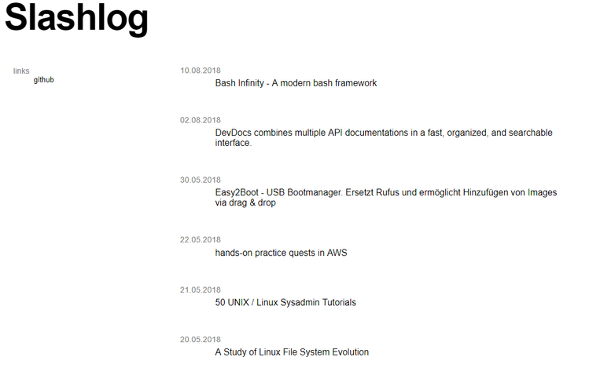

# other projects

## bashblog

bashblog is a static blog generator, link list and knowledge base.
It solves a simple problem: How to preserve the thought or a summary of an article or video.

bashblog receives links and videos via email and stores a text connected to it. This way an article and the gained knowledge keeps its value.

?> Share via mail is available on every platform, in every app and tool.

E-mail is lightweight and works everywhere, even in the subway.

?> By storing whole sentences it becomes searchable and even indexable by Google.

bashblog started as a simple script, but by [publishing it to GitHub](https://github.com/6uhrmittag/bashblog), it thought me much more than scripting.