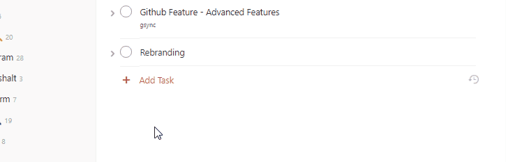
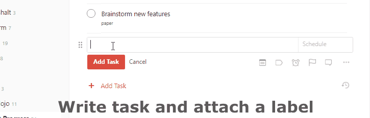

# taskbutler

## Milestone #1 - Dropbox Feature - First release

### issue #14: Rebranding
Naming a tool is a great way to ensure it's quality.
The initial reason was purely practical: 3rd party APIs and pypi require a name. But,

?> finding a pretty name increased my motivation for future features a lot.

I'm still super proud of it.

### issue #20: Create dropbox paper and link to task
After successfully releasing the progress bar-feature, I dug a bit deeper into the universe of 3rd party APIs. Taskbutler now was more than just one script to solve a specific problem.

Finding [Dropbox Paper](https://www.dropbox.com/en/paper), pure luck

After using and disliking [Quip](https://quip.com/), I had high hopes for Dropbox Paper. I actually used it do brainstorm the Dropbox Paper functionality, since it always bugged my how limited the Todoist comment-functionality is.

A few years ago I tried [Atlassian's Confluence](https://confluence.atlassian.com/) + Jira for personal task tracking and knowledge management. It turned out pretty well, but it's just a tiny bit too expensive and produces a lot of overhead. It's also lacking a usable todo mobile app. Anyway...

?> The key to success: Easy to use SDKs

Dropbox Paper turned out to be a great tool to enhance normal tasks. After finding the [official Python SDK for Dropbox API v2](https://github.com/dropbox/dropbox-sdk-python), it was pretty easy to implement the basic functionality of creating and linking papers. Unfortunately the paper-API is still in development and I had to work around some limitations such as searching for papers.




The flow is pretty straightforward:

- The user creates a folder and an initial paper
- Taskbutler searches for a task with a specific label name
- checks if the task-title already contains an URL
- If no URL is found:
  - it creates a new Dropbox Paper with the task-title as content
  - adds the URL to the Todoist task-title using Todoist's formatting syntax

!> The main issue is keeping the link between task and paper alive.

Since no additional metadata can be stored within the task, Taskbutler relies on the URL in the task-title to be right.

Additionally, I stumbled on two weird issues:

- the API can't find an empty folder - the user has to place an initial paper inside the folder
- the default permissions are set to public, which requires Taskbutler to always modify the permissions on new papers


### issue #19: Upload template to Dropbox and link task to Office365
This feature is pretty wild!

It makes use of the Microsoft Office 365 integration in Dropbox.
Once Office 365 is connected to Dropbox, it is possible to open Office documents directly from the web-view of Dropbox. The file will then open right inside office.com(a web version of Word, Excel, Powerpoint).




The implementation is wild but super simple. It makes use of the fact that Dropbox URLs to Office 365 are always following the same schema:

````text
https://www.dropbox.com/ow/msft/edit/home/<$FOLDER>/<$FILENAME>
````

Once one is logged into Dropbox and clicks on a link like the above, the corresponding file will open the web version of Microsoft Office.

Since Todoist [allows URLs in tasks to be clickable](https://todoist.com/de/help/articles/text-formatting), the integration is almost seamless. To make use of this feature, Taskbutler will also upload a specified file to Dropbox when the feature label is found.

My main goal is to make it super easy to write a simple letter in case of e.g. cancelling a contract or similar things that require a default template. It saves a ton of time to select and edit a template once and using it with this feature.

This feature opens up a whole world of similar workflows. Maybe adding e-mail templates or even integration of online postage services that sends the finished letter once it's marked as done.

### issue #27: Test in production
At this point in development, I noticed that the lack of tests is very problematic.
I already added a devmode that runs without making changes, but I still relied on real-life tests with my personal account and during my personal usage. The functionality was still very limited and so were the test cases, but I clearly noticed the issue of missing tests.

Even today the test coverage is not very high. That's why Taskbutler still fails very early and hard in case of any malfunction.

Since Taskbutler modifies important user-data, it rather crashes completely than corrupts any Todoist data.

### issue #25: Log rotation
Unfortunately, this is one of those issues, that are easily avoidable with proper testing. After a few days of personal usage, I noticed logfiles a size 50-100MB. This was due to a debug-log that generated tons of data. Adding rotation solved the issue 

## milestone: holding the development due to not keeping up with upstream dependencies


!> Copy and Past from the initial published release information at Github. I may write more about it in future

### The project is currently on pause due to changes in the third-party APIs.

**TLDR**: Taskbutler currently doesn't work as expected anymore. I plan to update Taskbutler in late 2023 ❤️

### A personal note about development and Todoist

I believe a significant issue preventing regular updates is the lack of end-to-end testing in Taskbutler, and in Todoist in general. When I delved into it, the best solution seemed to be to have a second premium account solely for testing – to build real end-to-end tests for the
changes made by Taskbutler. However, at the time I started developing Taskbutler, this wasn't a feasible option for me. As a result, when I changed _just one a small thing_, I didn't validate the entire feature set. This also dissuaded me from updating all dependencies right at
release.

For the past few months, I haven't used Todoist because my "everything in one app" approach left me feeling overwhelmed a few times. This led to the current state - a few weeks ago, I realized that I had unplugged the Raspberry Pi that Taskbutler was running on... so I can't even
confirm if any part of Taskbutler still works.

**BUT I'm still excited about Todoist!**

Todoist has undergone numerous changes over the past years. They've added a lot of minor features, but also made significant changes to their integrations - (I think. Maybe they've just rebranded to appear more open;D) - but I still love the features of Todoist that set it apart.
The super-fast natural input and, most importantly, they remain one of the few with full API support and SDKs for multiple languages.

The thing that rekindled my passion for Todoist was the announcement of experiments with **durations for tasks** (https://twitter.com/amix3k/status/1679047472729997312). This was one of my initial ideas for Taskbutler that I never realized because I didn't know where to store the
necessary information (end date, duration) without awkwardly including it in the description or even in an external database... It would be fantastic to see that feature natively in Todoist!

Anyway, as I mentioned earlier, I plan to update Taskbutler in late 2023❤️

In case I write more about it, you can find my thoughts at https://slashlog.org/#/blog/dev/
