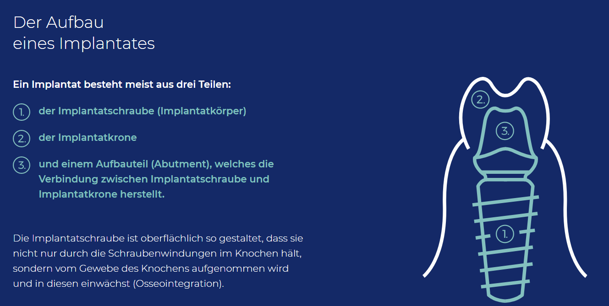

# Notetaking

## Techniken

Die Idee, dass _note-making_ sinnvoller ist, als _note-taking_, ist keine neue.  
Edgar Wright hat bereits vor 40 Jahren die Vorteile von _note-making_ beschrieben - weil hierbei Informationen wirklich verbunden (und somit langzeit-gespeichert) werden(Buch: On Your Own by Edgar Wright). Wissenschaftliche Arbeiten scheinen zu bestätigen, dass das einfache _
note-taking_ kaum einen Langzeiteffekt hat.  
Wichtig beim Erstellen von Notizen ist vor allem, dass eigene **umformulieren** in die eigene Sprache, das **Verknüpfen** mit ähnlichen Themen und das tiefe verknüpfen **mit eigenem Wissen**.[1]

Eine der Arten, alle nötigen Schritte zu vereinen ist diese hier - das Erstellen eines digitalen Gartens, indem das eigene Wissen heranwächst.

### Mindmap

Es gibt viele verschiedene Arten von "mentalen Karten". z.B. Mental maps, Cognitive maps, Mind maps, Concept maps.

#### Mentaler Atlas

Interessant ist die Idee eines _mentalen Atlasses_ - hier wird die Karte in einen komplexen, mentalen Atlas erweitert, in dem alle Ideen und alles Wissen verknüpft ist.

> A mental atlas is not just a way to think; it’s a way to explore. Interconnected maps form a dynamic, ever-evolving system where new information and new questions ripple across your internal web of thought to re-shape your beliefs.

#### Weiterführend

1. [https://nesslabs.com/mental-atlas](https://nesslabs.com/mental-atlas)
2. [https://nesslabs.com/thinking-in-maps](https://nesslabs.com/thinking-in-maps)

## Quellen

1. [https://nesslabs.com/from-note-taking-to-note-making](https://nesslabs.com/from-note-taking-to-note-making)

# Zahnersatz

- Krankenkasse trägt Kosten von ca. 50% der Regelbehandlung [4]
- Zahnersatz aus Metall ist grundsätzlich temperaturempfindlich [12]

## Implantat vs. Brücke

|                         | Implantat                                                    | Brücke                                                       | Bemerkung |
| ----------------------- | ------------------------------------------------------------ | ------------------------------------------------------------ | --------- |
| Haltbarkeit             | 15 – 20 Jahre [5]                                            | 7 – 10 Jahre [5]                                             |           |
| Umfang/Dauer Behandlung | 3 – 6 Monate Einheilzeit, insgesamt 5 Termine (Untersuchung, OP, Fäden ziehen, Freilegung des Implantats, Einbringen der Kronen) [5] | keine Einheilzeit, 4 Termine (Untersuchung, Beschleifen, Zwischenprobe, Eingliederung der Brücke) [5] |           |
| Abheilung               | bis zu 12 oder mehr Monaten dauern [8]                       |                                                              |           |

## Implantat

- "künstliche Zahnwurzeln" [11]

- Sofortimplantat -> Sofort nach Ziehen. Oft nicht möglich [8]
- Spätimplantat -> Zeitversetzter Knochenaufbau + Implantierung [8]

- stellt einen chirurgischen Eingriff da [1]
- es ist nicht sichergestellt, dass der Eingriff wahrscheinlich erfolgreich verläuft (Statistisch Probleme: 3 % sofort, 75 % nach 15 Jahren) [1]
- viele Faktoren beeinflussen Erfolg [1]
    - Gesundheitszustand [1]
    - Wundheilung [1]
    - Nikotin und Alkohol [1]
    - Ausreichendes Knochenangebot [1]
- ist nicht genug unterliegender Knochen vorhanden, ist Knochenaufbau nötig [7]
    - bei größerem Knochenaufbau kann Implantierung erst nach 9-12 Monaten erfolgen [7]
- detailierter Ablauf [13]

## Ablauf

1. Knochenaufbau
    1. falls nötig. Je nach Menge Dauer 6-12 Monate [9]
2. Einsetzen Haltestift (das eigentliche Implantat) [9]
    1. Heilungsdauer: ca. 10 Tage [9]
3. Aufsetzen/Verbinden des Ersatzes(Suprakonstruktion). Nach: 3-6 Monaten [9]
    1. Oberkiefer heilt schneller als der Unterkiefer [9]

## Kosten

- Detailliertes Beispiel [3]
- Einzelimplantat im Backenzahnbereich
    - ca. 1.000 bis 2.500 Euro [13]
    - durchschnittliche Startpreis der Vergleiche betrug 3553 Euro [14]

### Risiken

- Einsetzen bei Backenzähne schwieriger [6]
- üblichen Risiken bei Eingriff in Knochen [1]
- Periimplantitis -> entzündliche Erkrankung im Umfeld des Implantats [13]

### Haltbarkeit/Langzeitprobleme

#### Rauchen

- erhöht generell mögliche Probleme  [5]
- garantiert Probleme bei mehr als zehn Zigaretten pro Tag rauchen [5]

## Brücke

- benachbarte Zähne verlieren bis zu 60 Prozent an gesunder Zahnsubstanz  [5]
- Bei starkem Knochenabbau kann späterer Wechsel von Brücke zu Implantat kann schwierig werden [5]

### Material

- bei Backenzahn kann Metall-Brücke mit Kunststoffverblendung ausreichen [5]

### Haltbarkeit/Langzeitprobleme

- Bei Ersatz (ca. nach 7-10 Jahren) muss noch mehr gesunde Zahnsubstanz abgeschliffen werden [6]

## Quellen

1. https://www.medikompass.de/zahnbruecke_oder_implantat.php
2. https://www.medikompass.de/zahnbruecken-kosten-und-preise.php
3. https://www.medikompass.de/implantat.php
4. https://www.medikompass.de/festzuschuss.php
5. https://www.dr-witteler.de/schwerpunkte/
6. https://www.envivas.de/magazin/zahn/implantat-versus-bruecke/
7. https://zahnarztzentrum.ch/blog/2016/11/28/knochenaufbau-wann-und-warum/
8. https://www.primomedico.com/de/behandlung/sofortimplantate/
9. https://www.primomedico.com/de/behandlung/zahnimplantat/
10. https://www.dr-kraus.com/implantatklinik
11. https://www.dr-kraus.com/implantatklinik/implantate/was-sind-implantate
12. https://www.dr-kraus.com/behandlungen/zahnersatz
13. https://www.deutsche-familienversicherung.de/zahnversicherungen/zahnzusatzversicherung/ratgeber/artikel/zahnimplantat-kosten-damit-muessen-sie-rechnen/
14. https://www.medikompass.de/backenzahn-implantat.php
