# BSI  Alternative IT-Grundschutz-Tools

Source: https://www.bsi.bund.de/DE/Themen/Unternehmen-und-Organisationen/Standards-und-Zertifizierung/IT-Grundschutz/IT-Grundschutz-Kompendium/Alternative-IT-Grundschutztools/alternative-it-grundschutztools_node.html

`IT-Grundschutz > IT-Grundschutz-Kompendium > Alternative IT-Grundschutz-Tools`

## evaluation

Tool-Angebote diverser Hersteller (in alphabetischer Reihenfolge)

| License/Cost                                                 | download                                          | Rating/Notes                                                 | Screenshot                                                   | Link                                             | URL                                                          | additional/fixed link                                  | notes                                                        |
| ------------------------------------------------------------ | ------------------------------------------------- | ------------------------------------------------------------ | ------------------------------------------------------------ | ------------------------------------------------ | ------------------------------------------------------------ | ------------------------------------------------------ | ------------------------------------------------------------ |
| ?                                                            | DEMO for download                                 | windows tool                                                 | 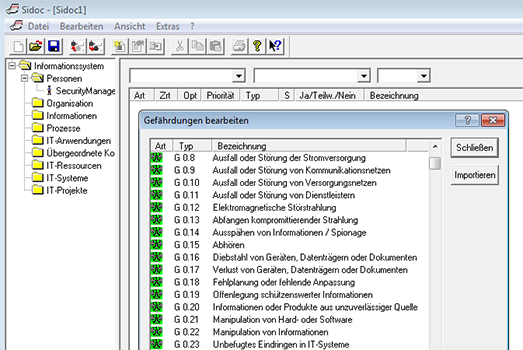 | Sidoc ® -Sicherheitsmanagement                   | https://www.2net.de/sidoc.html                               |                                                        |                                                              |
| ?                                                            | -                                                 | full auditing suite                                          |  | DocSetMinder                                     | https://www.docsetminder.de/                                 |                                                        |                                                              |
| ?                                                            | -                                                 | full auditing suite                                          |  | risk2value ISMS                                  | https://avedos.com/risk2value-isms-bsi-solution/             | https://www.gbtec.com/de/software/bic-bsi-grundschutz/ |                                                              |
| ?                                                            | -                                                 | full auditing suite                                          |  | CRISAM® – Die Risikomanagement Methode           | https://www.crisam.net                                       |                                                        |                                                              |
| ?                                                            | -                                                 | DSGVO/Datenschutzkonzept only, browser app                   | none found                                                   | CareNavigator                                    | https://www.carenavigator.de                                 |                                                        |                                                              |
| ?                                                            | -                                                 | full auditing suite                                          | none found                                                   | 360inControl®                                    | https://360incontrol.ch/de/compliance-management-deutsch/    |                                                        |                                                              |
| ?                                                            | -                                                 | "Cloud-Applikation"                                          | none found                                                   | EasyISMS                                         | http://www.concat.de/concat-loesungen/security/easyisms/     |                                                        |                                                              |
| ?                                                            | -                                                 | 2 addons: asset importer, web-app for data input             | 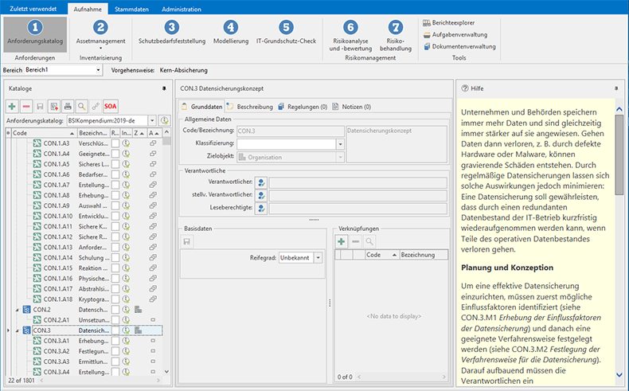                    | INDART® Professional                             | http://www.contechnet.de                                     |                                                        |                                                              |
| ?                                                            | -                                                 | full auditing suite                                          | 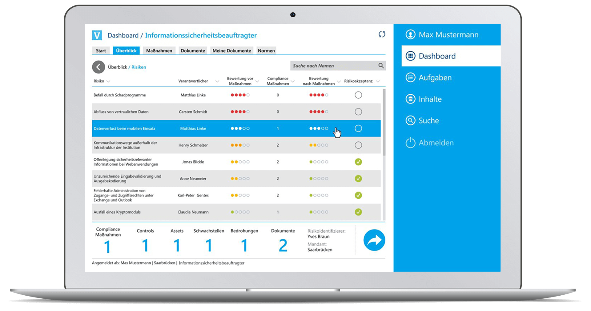                | DHC VISION Information Security Manager          | http://www.dhc-vision.com/produkte/information-security-management-software/ | https://www.dhc-vision.com/software/isms-software/     |                                                              |
| "ab 349,- € pro Monat"                                       | -                                                 | ISMS-as-a-Service, customized module per customer            | 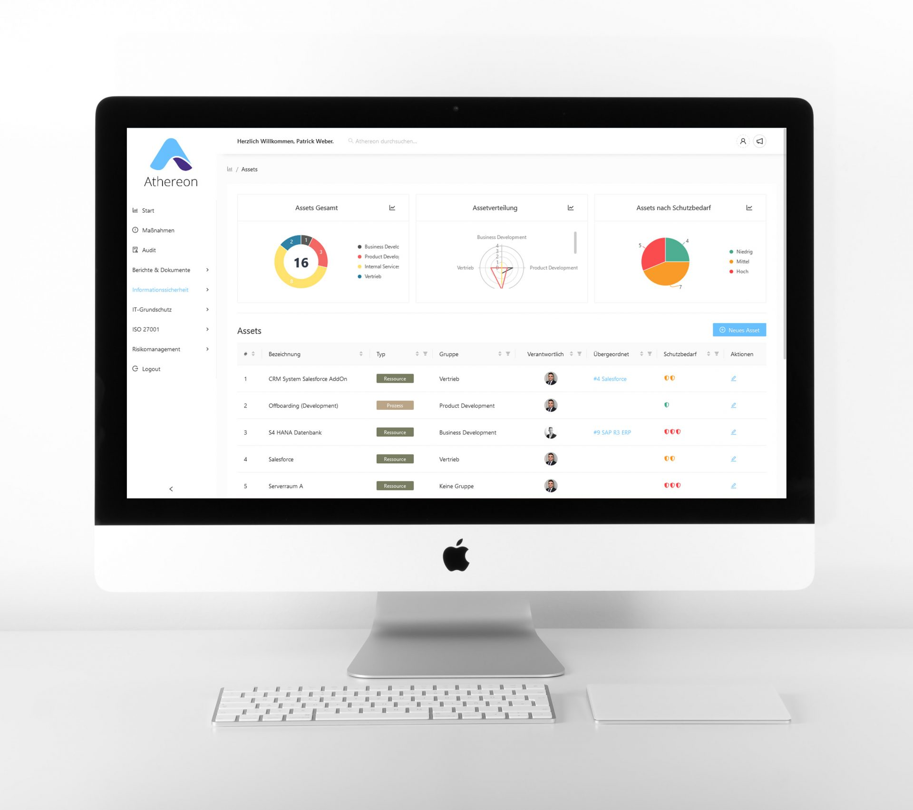 | Athereon GRC                                     | https://www.athereon.de                                      |                                                        |                                                              |
| https://www.etes.de/edira/preise/ example ISO-27001: 400€+160€/h for initial consultation + 79€/month | -                                                 | pesonal/subjective note:  good balance of business&tech-speak, would call | 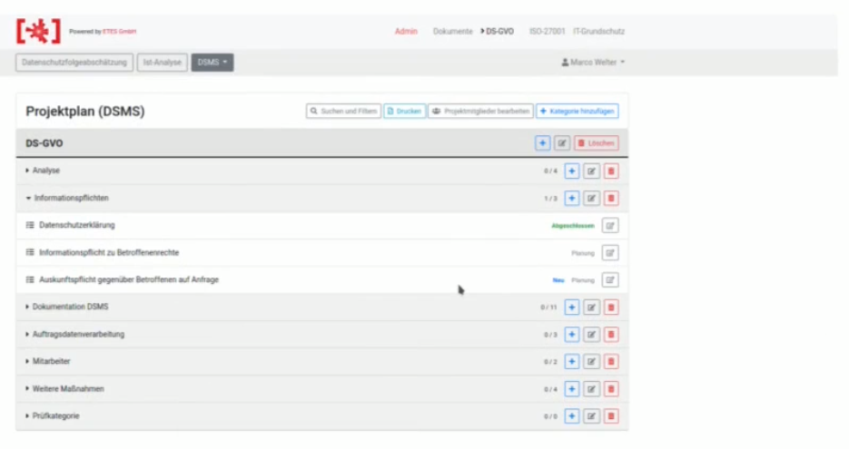 | EDIRA                                            | https://www.etes.de/data-privacy/datenschutz/edira/          |                                                        |                                                              |
| https://www.standardfusion.com/pricing/Starter: $750/mo Onboarding: $2,500 | 14 day trial upon request                         | pesonal/subjective note: one of the few websites that doesn't hide the tool behind business talk | 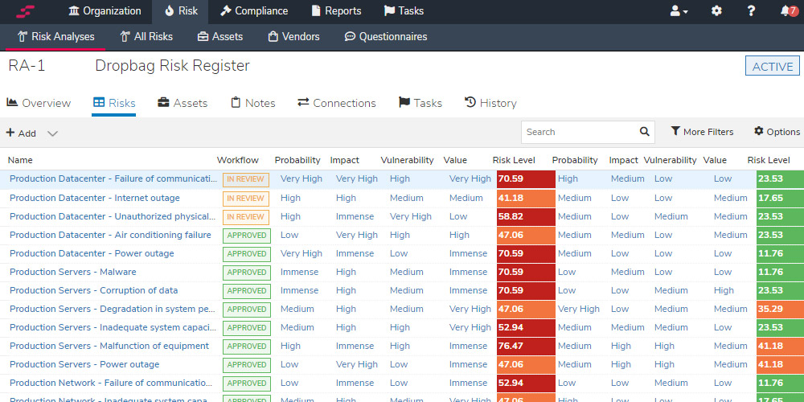                       | Standard Fusion                                  | http://www.standardfusion.com                                |                                                        |                                                              |
| ?                                                            | -                                                 | wirkt, als wäre es auf mehrere "sinnvolle Zusatzmodule" aufgeteilt | 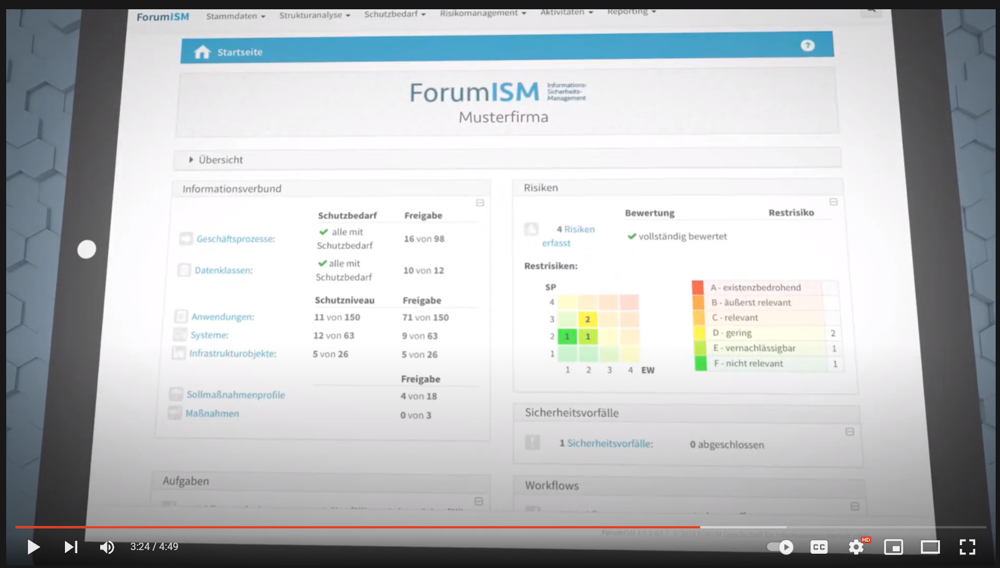 | ForumISM                                         | https://www.forum-is.de/software/forumism/                   |                                                        |                                                              |
| ?                                                            | -                                                 | Sollmaßnahmenkatalog addon für ForumISM                      | -                                                            | ForumNSR                                         | https://www.forum-is.de/software/forumnsr/                   |                                                        |                                                              |
| ? (Modulares Preismodell)                               | demo upon request                                 | modern looking web UI [website is a decent ressource for facts about](https://www.fuentis.com/isms/isms-bsi-standard-100-it-grundschutz-tool.html) ISMS/BCMS/DSMS/CMDB/GRC  cloud or selfhosted: https://www.fuentis.com/fuentis-suite.html | 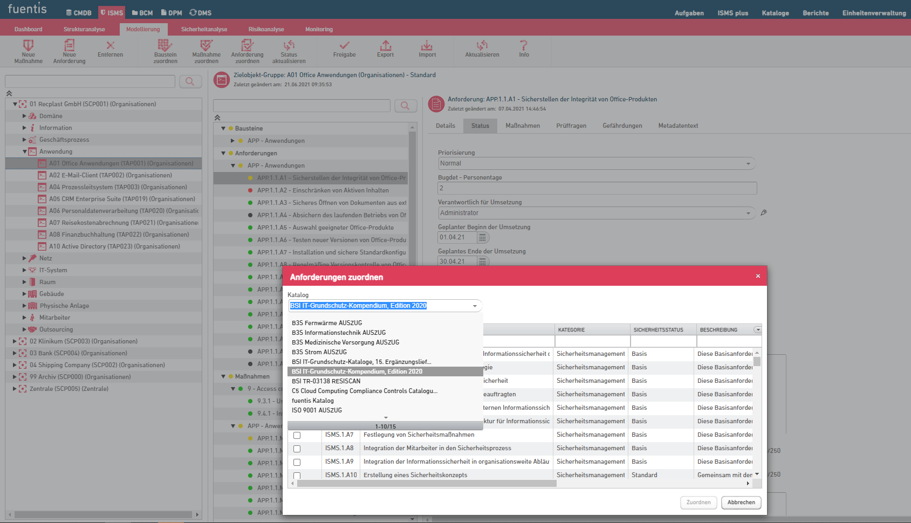 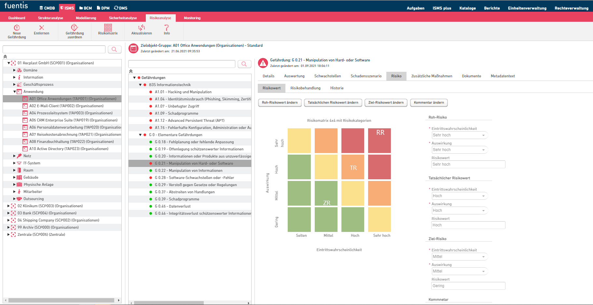 | fuentis ISMS                                     | http://www.fuentis.com                                       |                                                        |                                                              |
| ?                                                            | -                                                 | pesonal/subjective note: website looks like 11 year old me build it for my dads serious business | 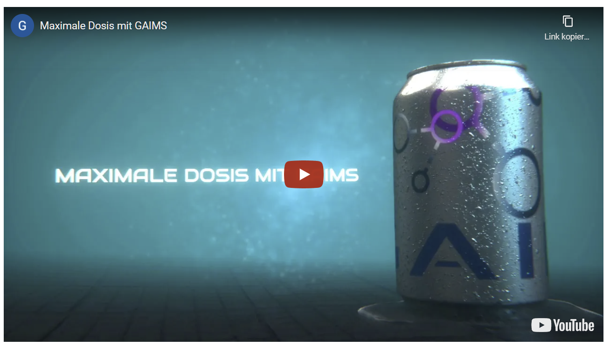  | GAIMS Information Security                       | https://gaimssoftware.de                                     |                                                        |                                                              |
| ?                                                            | -                                                 | "860.951 lines of code", but no screenshot on the oficiall website | 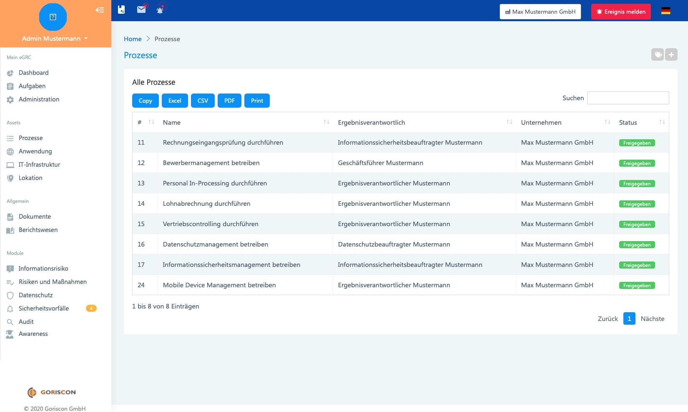 | embeddedGRC                                      | https://goriscon.de/                                         | https://www.softguide.de/programm/embedded-grc         |                                                              |
| ?                                                            | -                                                 |                                                              | 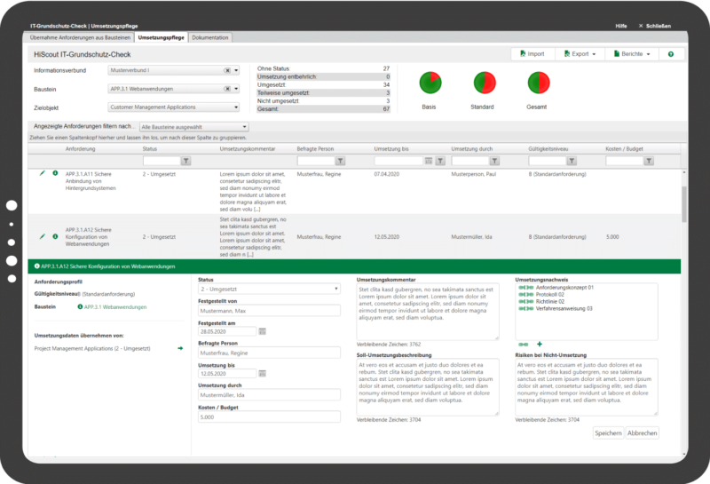 | HiScout Grundschutz                              | https://www.hiscout.com/module/grundschutz/                  |                                                        |                                                              |
| ? (Named‐User‐Lizenzmodell)                             | -                                                 | one of the few websites that include public, tool specific whitepapers&how-to videos cloud&on-premise good balance of business&tech-speak, | 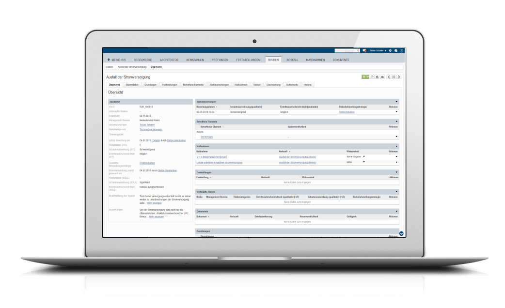      | ibi systems iris                                 | http://www.ibi-systems.de/                                   |                                                        |                                                              |
| https://www.save-infodas.de/save-kaufen/ min. 1.170€ in fist year, 155€/year after first year | 30 day trial upon request                         | addons for "Informationssicherheit in der Bundeswehr"        | 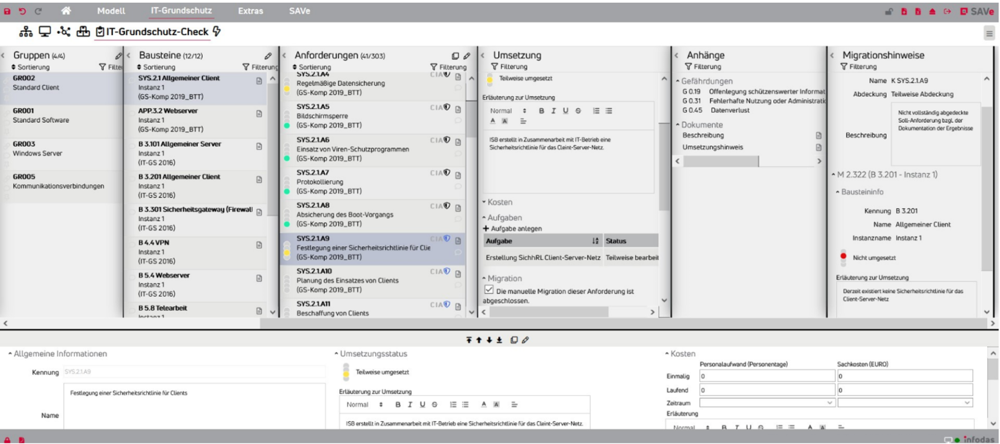          | SAVe                                             | http://www.save-infodas.de                                   |                                                        |                                                              |
| IT-Grundschutz Kit: 499€ (1 user) (for higher plans: flexible SaaS  or perpetual license) | 3 month trial upon request                        | looks good [website lists interesting, public webbinars with real-life examples](https://infopulse-scm.com/videos/) [IT-Grundschutz Starter Kit](https://infopulse-scm.com/solutions/grundschutz-starter-kit/) [ISO 27001 Starter Kit](https://infopulse-scm.com/solutions/iso-27001-starter-kit/) | 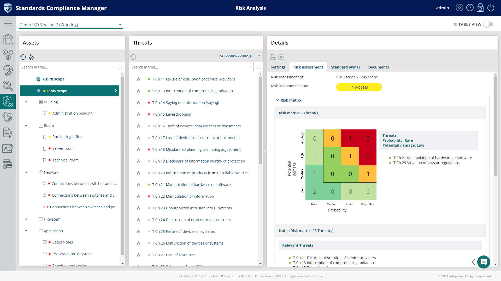                      | Standards Compliance Manager Grundschutz Edition | https://www.infopulse.com/de/dienstleistungen/dienstleistungen-zur-informationssicherheit/security-compliance-manager-scm/ |                                                        |                                                              |
| für Firmen 15 EUR / Monat                               | kostenlos für Privatpersonen(mit einschränkungen) | login funktioniert nicht -> HTTP 500                         |                                                              | vnoc42                                           | https://noc.virtual42.com/                                   |                                                        | wirbt mit "als gelisteter Partner des BSI" https://noc.virtual42.com/de/?t=IT-Grundschutz |
| https://www.kronsoft.de/download/free/Preisuebersicht-opus-i.pdf Kosten unklar, Kosten für Support&Serverversion | https://www.kronsoft.de/downloadopusi.html        |                                                              | 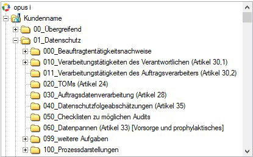       | opus i - Informationssicherheit                  | http://www.kronsoft.de/it-sicherheit/it-sicherheit.html      |                                                        |                                                              |
| https://www.preeco.de/pakete-und-preise je Dokumentenanzahl |                                                   | Datenschutzmanagement, nicht IT Grundschutz                  | 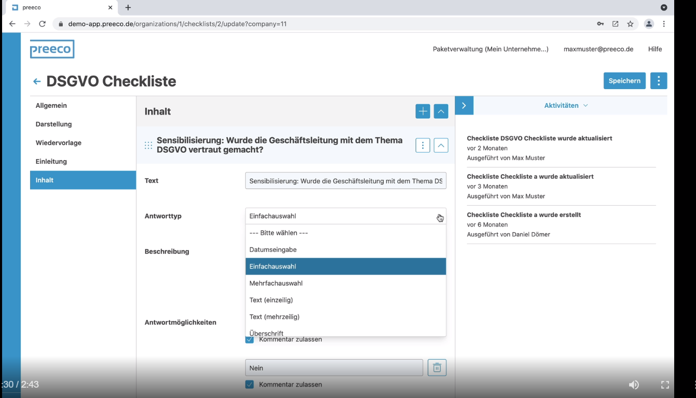 | Datenschutzmanagement-Software                   | https://www.preeco.de/                                       |                                                        |                                                              |
|                                                              |                                                   |                                                              |                                                              | Efficient IT security and compliance             | http://adamant.q-e.at/                                       |                                                        |                                                              |
|                                                              |                                                   |                                                              |                                                              | qmBase                                           | http://www.qmbase.com                                        |                                                        |                                                              |
|                                                              |                                                   |                                                              |                                                              | GS-Tool                                          | http://www.revisec-datenschutz.de/gs-tool.htm                |                                                        |                                                              |
|                                                              |                                                   |                                                              |                                                              | S&L Compliance Suite                             | https://www.sul.de/compliance-suite/                         |                                                        |                                                              |
|                                                              |                                                   |                                                              |                                                              | GRC-COCKPIT                                      | https://saviscon.de/grc-cockpit                              |                                                        |                                                              |
|                                                              |                                                   |                                                              |                                                              | R2C_SECURITY                                     | http://grc.schleupen.de/loesungen/r2c-security-informationssicherheit-datenschutz/ |                                                        |                                                              |
|                                                              |                                                   |                                                              |                                                              | Audit Tool 2006                                  | http://www.secure-it-consult.com/default.htm?page=/audit2006.htm |                                                        |                                                              |
|                                                              |                                                   |                                                              |                                                              | Verinice Open Source ISMS Tool                   | http://verinice.org                                          |                                                        |                                                              |
|                                                              |                                                   |                                                              |                                                              | ATRADIS<Review                                   | https://www.tcc.de/atradis/review                            |                                                        |                                                              |
|                                                              |                                                   |                                                              |                                                              | ISiMap                                           | http://www.temino.de/leistungen/isimap.html                  |                                                        |                                                              |
|                                                              |                                                   |                                                              |                                                              | HITGuard                                         | https://www.togethersecure.com/bsi-it-grundschutz-methodik-mit-hitguard-umsetzen/ |                                                        |                                                              |
|                                                              |                                                   |                                                              |                                                              | quidit                                           | http://www.quidit.de                                         |                                                        |                                                              |
|                                                              |                                                   |                                                              |                                                              | QSEC ISMS & GRC                                  | http://grc-qsec.com/                                         |                                                        |                                                              |

